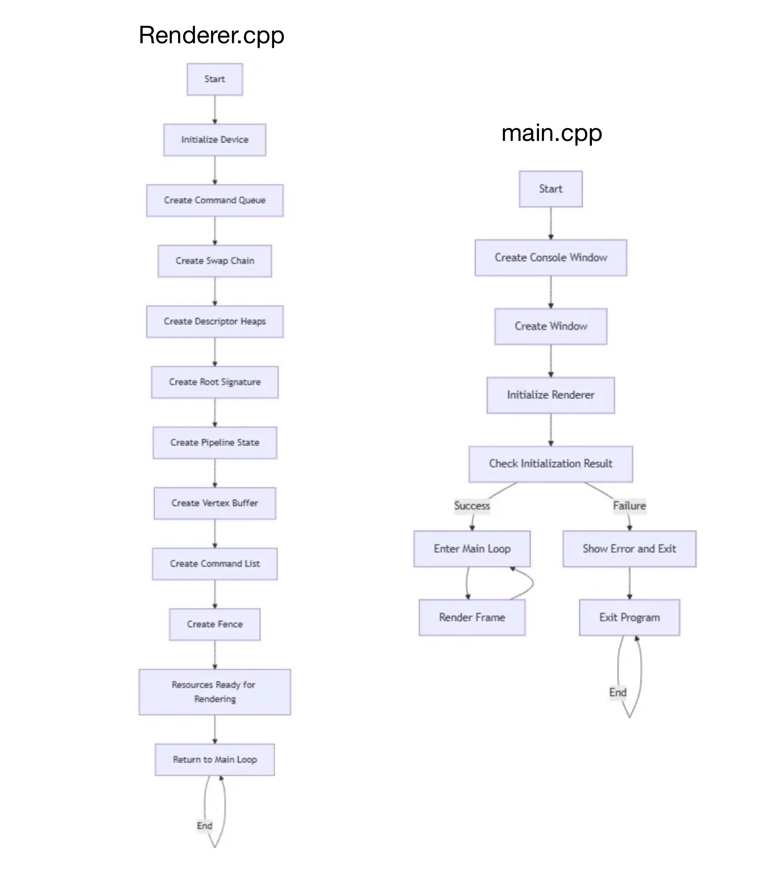

# Direct3D 12 Triangle Rendering

## Project Introduction
This project demonstrates a fundamental implementation of rendering a triangle using Direct3D 12, Microsoft's low-level graphics API. The goal is to provide a minimal yet complete example of modern GPU rendering, showcasing the essential components and their interactions.

The application initializes a Direct3D 12 device, sets up the necessary rendering pipeline, and draws a single triangle on the screen. Key features include:
- Efficient use of command queues and lists for GPU commands.
- Pipeline State Object (PSO) configuration for shaders and fixed-function stages.
- Frame synchronization with fences and double buffering via swap chains.

## **Project Setup and Environment**

- Build System and Compiler Information
    - Build System Generator:  [CMake](https://cmake.org/)
    - Build System: [MSBuild](https://learn.microsoft.com/en-us/visualstudio/msbuild/msbuild?view=vs-2022)
    - Compiler: [MSVC (Microsoft Visual C++)](https://learn.microsoft.com/en-us/cpp/?view=msvc-170)
    - Integrated Development Environment (IDE): [Visual Studio 2022](https://visualstudio.microsoft.com/)
- Libraries and Tools
    - Graphics and Rendering: [DirectX 12](https://learn.microsoft.com/en-us/windows/win32/direct3d12/directx-12-programming-environment) 
    - Windows Platform Interface: [Windows API](https://learn.microsoft.com/en-us/windows/win32/api/) 
    - COM Programming: [Microsoft WRL (Windows Runtime C++ Template Library)](https://learn.microsoft.com/en-us/cpp/cppcx/wrl/using-the-windows-runtime-cpp-template-library-wrl?view=msvc-170) 
- Version Control
    - Version Control System: Git

## Direct3D Rendering Workflow
### Outline

#### Initialization
- **CreateDevice()**: Creates the Direct3D 12 device, which interfaces with the GPU for rendering.
- **CreateCommandQueue()**: Sets up a command queue to send rendering commands to the GPU.
- **CreateFence()**: Initializes a synchronization fence for GPU and CPU coordination.
- **CreateSwapChain(HWND hwnd)**: Sets up a swap chain for presenting frames to the window. This supports double or triple buffering for smooth rendering.
- **CreateDescriptorHeaps()**: Allocates descriptor heaps for GPU resource management, such as render target views (RTVs) and depth stencil views (DSVs).
- **LoadShaders()**: Compiles vertex and pixel shaders, which define how geometry is transformed and pixels are colored.
- **CreateRootSignature()**: Defines the interface between the application and shaders, specifying how resources like textures and buffers are bound.
- **CreatePipelineState()**: Configures the graphics pipeline, including the shaders, root signature, and pipeline settings like blending and rasterization.
- **CreateCommandList()**: Prepares a command list to record rendering commands.
- **CreateVertexBuffer()**: Uploads vertex data for geometry into a GPU-accessible buffer.

#### Rendering 
- **ExecuteCommandList()**:
    - Prepares the GPU for rendering by resetting and configuring the command list.
    - Binds the root signature and vertex buffer to the pipeline.
    - Records draw calls to render geometry and submits the commands for execution.
- **Render()**:
    - Manages the per-frame rendering process.
    - Clears the render target and optionally the depth stencil to ensure a fresh frame.
    - Sets up the viewport and scissor rectangles for rendering.
    - Executes the command list to render geometry.
    - Transitions the back buffer between the rendering and presentation states.
    - Presents the rendered frame using the swap chain.
    - Prepares the command allocator and command list for the next frame.

### Class


## Result


## How to build
```bash
cd into/your/project/path
mkdir build
cd build
cmake ..
cmake --build . --config Release
cd Release
Direct3D12Renderer.exe
